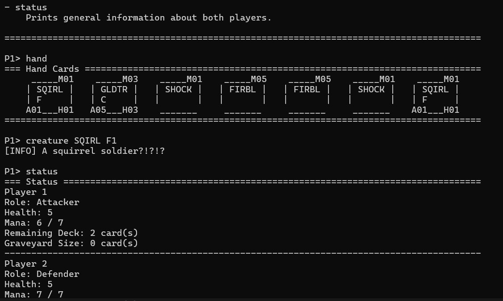

# Card Game

A turn-based, two-player trading-card game written in modern C++ (C++20),
inspired by games like *Magic: The Gathering* and *Hearthstone*. Two players
take turns summoning creatures, casting spells and spending mana to defeat the
opponent on a shared battlefield. The whole game runs in the terminal and is
driven entirely by text commands.

The project is a self-contained console application: it loads a game
configuration and a set of localizable messages, then runs the full game loop
until one player wins.



## Gameplay Overview

- **Two players** face off across a shared **board** made up of battle slots.
- Each turn a player draws cards, gains **mana**, and can play **creatures** or
  **spells** from their hand.
- **Creatures** have an attack value, health, and one or more **traits** that
  change how they behave in combat.
- **Spells** produce one-off effects (damage, buffs, summons, resurrection,
  etc.).
- Combat resolves slot by slot: creatures fight each other, or hit the enemy
  player directly if the slot is undefended.
- The game ends when a player is defeated, can no longer draw a card, or the
  maximum number of rounds is exceeded.

### Creature Traits

Creatures can carry traits that alter combat, for example:

- **Haste** – can act the turn it is summoned
- **First Strike** – deals its damage before the opponent
- **Brutal** – excess damage carries over
- **Venomous / Poisoned** – applies damage over time
- **Lifesteal** – heals its owner for the damage dealt
- **Undying** – returns after being destroyed
- **Regenerate** – heals back up between rounds
- **Challenger** – forces the opponent to engage it
- **Temporary** – only lasts for a limited time

## Project Structure

```
.
├── main.cpp              # Entry point: argument handling and startup
├── Game.*                # Core game loop, phases, rules and command dispatch
├── Board.*               # The battlefield and its slots
├── Player.*              # A player: hand, deck, graveyard, health, mana
├── ManaPool.*            # Mana tracking and spending
├── Card.*                # Abstract base card
├── Creature.*            # Creature cards and their traits
├── Spell.*               # Spell cards and their effects
├── CardDatabase.*        # Loads creature/spell definitions from data files
├── CardCreator.hpp       # Factory that builds concrete cards by id
├── Command.* / CommandLine.*  # Parsing and modelling of user input
├── Messages.*            # Loadable, localizable output messages
├── GameError.hpp         # Error/exception types
├── Utils.*               # Helper utilities
├── data/                 # Creature and spell definitions
├── configs/              # Game configurations and message config
└── Makefile              # Build, run and cleanup targets
```

## Building and Running

The project uses a `Makefile` and `clang++` (C++20).

```sh
make bin      # compile the executable (a2)
make run      # build and run with a default configuration
make clean    # remove build artifacts
make help     # list available targets
```

Run manually with an explicit game config and message config:

```sh
./a2 ./configs/<game_config>.txt ./configs/message_config.txt
```

The program expects exactly two arguments — a game configuration file and a
message configuration file — and exits with a descriptive error otherwise.

## Data & Configuration Formats

**Creatures** (`data/creatures.txt`) — one per line:

```
mana;ID;Name;Trait[;Trait2];attack;health
```

**Spells** (`data/spells.txt`) — one per line (`XX` marks a special/variable cost):

```
mana;ID;Name
```

**Game config** (`configs/*_game_config.txt`) starts with the `GAME` keyword,
followed by the game parameters (rounds, mana, etc.) and the two players'
decks as `;`-separated lists of card ids.

## In-Game Commands

The game reads commands from standard input. Supported commands include:

| Command     | Description                                        |
|-------------|----------------------------------------------------|
| `help`      | Show available commands                            |
| `hand`      | List the cards in your hand                        |
| `board`     | Print the current battlefield                      |
| `graveyard` | Show destroyed cards                                |
| `status`    | Show player status (health, mana, round)           |
| `info`      | Show details about a card                          |
| `creature`  | Summon a creature to the board                      |
| `spell`     | Cast a spell                                        |
| `battle`    | Declare an attack                                   |
| `redraw`    | Redraw your hand                                    |
| `done`      | End your turn                                       |
| `quit`      | Exit the game                                       |

## Tech

- **Language:** C++20
- **Build:** GNU Make + clang++
- **Style:** object-oriented design with smart pointers (`shared_ptr` /
  `weak_ptr`), polymorphic cards, and a factory-based card creation system.

