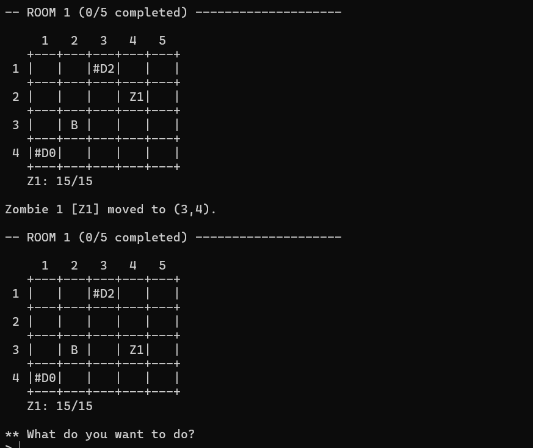
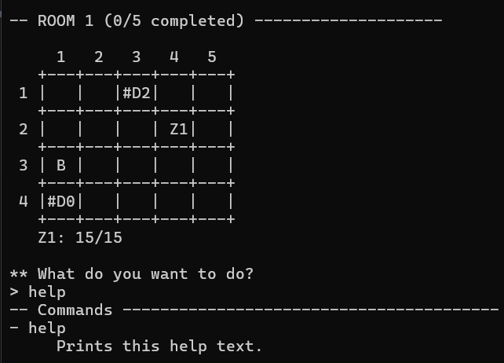
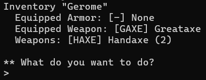

# Dungeons & Classes

A text-based, turn-based dungeon crawler written in modern **C++17**, loosely inspired by the tabletop
role-playing game *Dungeons & Dragons*. One to three players explore a dungeon of interconnected rooms,
fight enemies, loot chests, use items and equipment, and try to defeat the dungeon boss — the **Lich**.

<!-- ┌─────────────────────────────────────────────────────────────┐ -->
<!-- │  SCREENSHOT: main game view / title screen                  │ -->
<!-- └─────────────────────────────────────────────────────────────┘ -->
<!-- Replace the line below with your screenshot: -->


---

## Table of Contents

- [Features](#features)
- [Gameplay](#gameplay)
- [Screenshots](#screenshots)
- [Getting Started](#getting-started)
- [Usage](#usage)
- [Commands](#commands)
- [Project Structure](#project-structure)
- [Configuration Files](#configuration-files)
- [Testing](#testing)
- [Authors](#authors)

---

## Features

- **Three playable classes** — Barbarian, Rogue, and Wizard, each with unique stats and starting equipment.
- **Turn-based combat** driven by alternating `Player Phase` and `Enemy Phase` rounds.
- **Grid-based dungeon** of interconnected rooms with doors, chests, enemies, and a boss.
- **Inventory & equipment system** — collect, equip, and use weapons, armor, and consumable potions.
- **Loot system** — defeated enemies and treasure chests can be looted.
- **Command-driven interface** built on the command pattern (`help`, `move`, `attack`, `loot`, `use`, …).
- **Configurable dungeons and stories** loaded from external text config files.
- **Deterministic randomness** via a seedable `Random` singleton (`RAND_SEED` environment variable) for
  reproducible runs and testing.
- **Robust input handling** — case-insensitive commands, whitespace tolerance, and graceful error messages.

---

## Gameplay

At the start of the game each player picks one of three classes:

| Class     | Playstyle                                        |
|-----------|--------------------------------------------------|
| Barbarian | High health and strength, close-quarters bruiser |
| Rogue     | Balanced and versatile                           |
| Wizard    | Spell-focused with special weapons               |

The game then proceeds in **rounds**, each made of two phases:

1. **Player Phase** — every player performs one action (move, attack, loot, or use an item).
2. **Enemy Phase** — if enemies share the current room, each one either attacks or moves.

A room is **completed** once no enemies remain in it. The game ends when the boss (Lich) is defeated,
the players leave the dungeon through the entrance, or every player falls.

---

## Screenshots

<!-- Add your screenshots here. Put the image files in the docs/ folder and update the paths below. -->

**Dungeon map**

<!-- Replace with your map screenshot: -->


**Inventory & player info**

<!-- Replace with your inventory screenshot: -->


---

## Getting Started

### Requirements

- A C++17-capable compiler (the project is set up for **clang++**; g++ works as well).
- **make** for the provided build system.

### Build

```bash
make bin
```

This compiles all sources into the executable `a2`. Other useful targets:

| Target       | Description                                   |
|--------------|-----------------------------------------------|
| `make bin`   | Compile the project to the `a2` binary        |
| `make run`   | Build and run with the default configs        |
| `make clean` | Remove build artifacts and the binary         |
| `make help`  | List all available make targets               |

> On Windows, build with a POSIX toolchain such as MSYS2/MinGW or WSL, or compile the `*.cpp`
> files directly with `clang++ -std=c++17 *.cpp -o a2`.

---

## Usage

The program takes two configuration files as arguments — a dungeon config and a story config:

```bash
./a2 configs/dungeon_config.txt configs/story_config.txt
```

Once running, type `help` to see all available commands.

---

## Commands

Legend: `-` display commands · `*` action commands (count as a player action)

| Command                                       | Type | Description                                              |
|-----------------------------------------------|:----:|----------------------------------------------------------|
| `help`                                        |  -   | Print the help text.                                     |
| `quit`                                        |  -   | Terminate the game.                                      |
| `story`                                       |  -   | Toggle the room stories on/off.                          |
| `map`                                         |  -   | Toggle the dungeon map on/off.                           |
| `positions`                                   |  -   | Print current player and enemy positions.                |
| `player <PLAYER>`                             |  -   | Print information about a specific player.                |
| `inventory <PLAYER>`                          |  -   | Print a player's inventory.                              |
| `move <PLAYER> <ROW>,<COL>`                   |  *   | Move a player to an adjacent field.                      |
| `loot <PLAYER> <ROW>,<COL>`                   |  *   | Loot an adjacent chest.                                  |
| `use <PLAYER> <ITEM>`                         |  *   | Use a potion or equip armor/weapon.                      |
| `attack <PLAYER> <ROW>,<COL>`                 |  *   | Attack a target with the equipped weapon.                |

`<PLAYER>` is the player type abbreviation and `<ITEM>` an item abbreviation from the player's inventory.

---

## Project Structure

```
.
├── main.cpp                 # Entry point, argument handling
├── Game.*                   # Core game loop and state
├── PlayCommand.*            # Main play flow / round logic
├── CommandParser.*          # Parses and dispatches user input
├── Command.hpp              # Abstract command base (command pattern)
│   ├── AttackCommand.*      # Individual command implementations
│   ├── MoveCommand.*
│   ├── LootCommand.*
│   ├── UseCommand.*
│   ├── HelpCommand.* / MapCommand.* / StoryCommand.* / ...
├── Entity.* / Character.*   # Base hierarchy for anything on the grid
│   ├── Player.*             # Playable characters
│   └── Enemy.*              # Enemy AI (attack / move)
├── Item.* / Weapon.*        # Items and weapons
│   ├── Armor.*
│   └── Consumable.*         # Potions
├── Dungeon.* / Room.*       # Dungeon and room layout
├── Field.*                  # Single grid cell
├── Random.*                 # Seedable RNG singleton (do not modify)
├── Exceptions.hpp           # Custom exception types
├── configs/                 # Dungeon and story configuration files
├── saves/                   # Generated save/output files
└── Makefile                 # Build system
```

**Design highlights**

- **Command pattern** — every user action is a `Command` subclass with a uniform `execute(Game*)`
  interface, dispatched by `CommandParser`.
- **Entity hierarchy** — `Entity → Character → Player / Enemy` centralizes shared state and behavior
  through virtual methods.
- **Item hierarchy** — `Item → Weapon / Armor / Consumable` models equipment and consumables uniformly.

---

## Configuration Files

The game is data-driven. Dungeons and stories are described in plain-text config files under
[`configs/`](configs/), so new levels can be created without touching the code. Each dungeon config
defines rooms, their sizes, doors, enemies, chests, and their contents; the story config supplies the
narrative text shown when entering rooms.

Example invocation with alternative configs:

```bash
./a2 configs/dungeon_config_05.txt configs/story_config.txt
```

---
