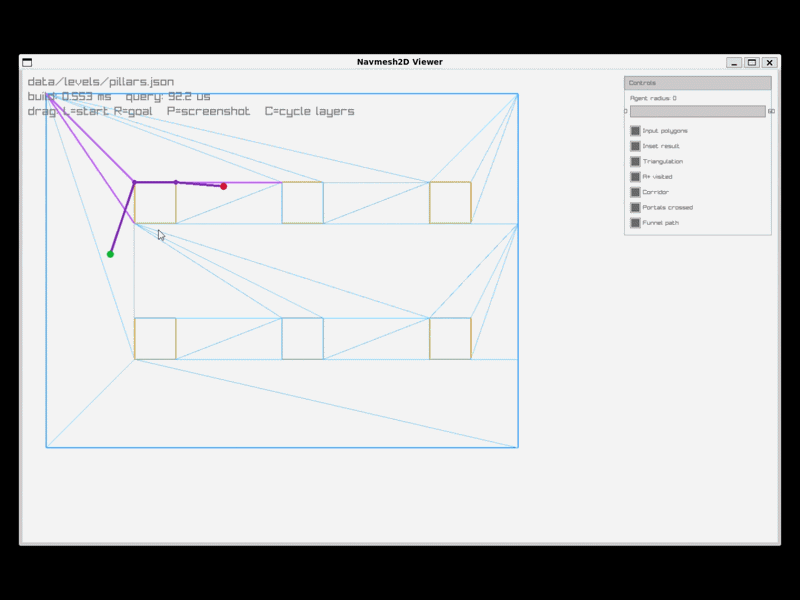

# Navmesh2D

A from-scratch 2D navigation mesh library: triangulation, A*, and string-pulling, all hand-written, in a raylib visualizer that shows every stage of the pipeline as it runs.

## Demo "Pillars"



## Implementation

| Stage | Implementation |
|---|---|
| Polygon offset (agent radius inset) | **Clipper2** (library) — robust float polygon offsetting is a rabbit hole not worth re-deriving |
| Ear-clipping triangulation + hole bridging | **hand-written** ([`triangulate.cpp`](src/nav/triangulate.cpp)) |
| A* over the triangle graph | **hand-written** ([`astar.cpp`](src/nav/astar.cpp)) |
| Funnel algorithm (string-pulling) | **hand-written** ([`funnel.cpp`](src/nav/funnel.cpp)) |
| Mesh adjacency, portals, spatial index | **hand-written** ([`mesh.cpp`](src/nav/mesh.cpp)) |

Everything else (JSON parsing via nlohmann/json, windowing/drawing via raylib, GUI widgets via raygui, test framework via doctest) is ordinary scaffolding, not the interesting part.

## Architecture

```
nav      — headless core (STATIC lib). Links only nlohmann/json + Clipper2. Never links raylib.
viewer   — raylib visualizer. Links nav + raylib + raygui.
bench    — headless timing harness. Links nav only — proves the core needs no window.
tests    — doctest suite. Links nav + doctest.
```

The strict separation — `nav` has zero rendering dependency — is deliberate: the algorithms are the product, the viewer is just a window onto them.

## Pipeline

```
Level (outer + holes, JSON)
  -> offset          Clipper2 inset by agent radius (offset.cpp)
  -> bridge holes    stitch holes into the outer contour (triangulate.cpp)
  -> triangulate     ear clipping (triangulate.cpp)
  -> mesh assembly   weld vertices, build adjacency + portals + spatial grid (mesh.cpp)
  -> A*              search the triangle graph for a corridor (astar.cpp),
                     cost = polyline length through crossed portal midpoints
  -> funnel          string-pull the corridor into a taut path (funnel.cpp)
  -> Path
```

`nav::build(level, settings) -> NavMesh` runs the first four stages. `NavQuery::findPath(start, goal) -> Path` runs the last two.

## Building

```sh
cmake -S . -B build -G Ninja -DCMAKE_POLICY_VERSION_MINIMUM=3.5
cmake --build build
```

Then, from the project root (sample levels and tests resolve paths relative to it):

```sh
./build/tests.exe          # run the test suite
./build/viewer.exe [level.json]   # default: data/levels/rooms.json
./build/bench.exe [level.json] [agentRadius] [numQueries]
```

## Viewer controls

- **Left mouse drag** — move the start point
- **Right mouse drag** — move the goal point
- Control panel (top-right): agent radius slider, and a checkbox per visualization layer (input polygons, inset result, triangulation, A* visited triangles, corridor, portals crossed, funnel path)

## Bench timings

Measured on the four sample levels (`bench <level> <agentRadius> <numQueries>`), Windows/MSVC Debug build:

| Level | Triangles | Build time | Mean query | Median query |
|---|---|---|---|---|
| `rooms.json` (r=0) | 8 | 0.3 ms | 25.7 us | 27.4 us |
| `pillars.json` (r=10) | 350 | 21.6 ms | 434.3 us | 359.2 us |
| `maze.json` (r=5) | 152 | 5.7 ms | 427.5 us | 392.2 us |
| `stress.json` (r=0, 80 pillars) | 283 | 81.1 ms | 53.2 us | 19.8 us |

These are Debug-build numbers (no optimizations) from a single run. `bench` writes per-query detail to `output/bench.csv`; `tools/plot_bench.py` turns that into a timing chart.

Vertex welding after hole bridging is currently an O(n²) linear scan (see `mesh.cpp`), which is the dominant cost in `stress.json`'s build time — the obvious next optimization if build time on large levels ever matters.

## What I'd do next

- **Dynamic obstacles / crowd steering** — the query API has room for it (`raycast` already exists for line-of-sight checks), but nothing here re-triangulates or locally patches the mesh at runtime.
- **3D / multi-floor** — out of scope by design; would mean voxelization or a different mesh representation entirely.

