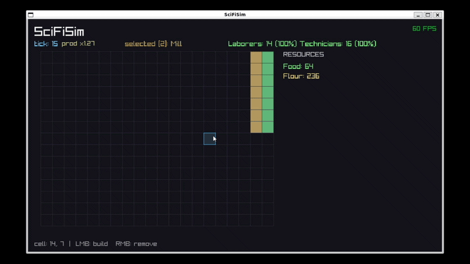
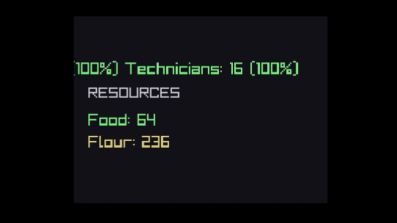

# SciFiSim

A data-driven city-builder simulation in a sci-fi setting, written in modern C++ with a headless simulation core and a raylib frontend. Build production chains, feed a population that evolves through tiers, and watch the economy react — all driven by editable JSON content with live hot-reload. Also adapted to feature add-ons where every building, population tier and resourse can be added easily in one code line.



## Features

- **Deterministic simulation core** — fully decoupled from rendering; the same seed and inputs always produce a byte-identical state (verified by a unit test hashing 1000 ticks).
- **Data-driven content** — resources, buildings, recipes, and population tiers are defined in `data/content.json`. No recompilation needed to change balance.
- **Hot-reload** — edit the JSON while the game runs; changes apply within half a second, with graceful handling of malformed files.
- **Production chains** — buildings consume and produce resources (e.g. Farm → Food, Mill: Food → Flour), creating supply bottlenecks to manage.



- **Population tiers** — citizens upgrade to more productive tiers when stably fed and paid, and degrade back under sustained shortage. Higher tiers boost city-wide production but demand more complex needs.
- **Binary save/load** — versioned binary format with a magic number and integrity checks.
- **Headless balance runner** — a separate executable runs thousands of ticks without a window and exports a CSV for balance analysis and plotting.

## Build

Requires CMake 3.20+ and a C++20 compiler. Dependencies (raylib, nlohmann/json, doctest) are fetched automatically.

```bash
cmake -B build -DCMAKE_BUILD_TYPE=Release -DCMAKE_POLICY_VERSION_MINIMUM=3.5
cmake --build build -j
```

Run from the project root (so `data/` is found):

```bash
./build/game        # interactive game
./build/tests       # unit tests
./build/balance     # headless balance run -> output/balance.csv
```

## Controls

- **Left mouse (drag)** — build selected building over an area
- **Right mouse** — remove building
- **1 / 2** — select building type
- **S / L** — save / load
- Edit `data/content.json` while running to hot-reload content

## Architecture

The project separates a headless simulation library (`sim`) from its consumers:

- `sim` — pure C++ core: world state, tick systems (production → consumption → population → progression), serialization. No rendering dependency.
- `game` — raylib frontend.
- `balance` — headless runner for balance analysis.
- `tests` — doctest unit tests (determinism, production, save roundtrip).

The same core drives all three executables, which is what makes it testable and analyzable without a GUI.

Tick system order:
`production → consumption → population → progression`

## Balance analysis

```bash
./build/balance 5000 1
python3 tools/plot.py output/balance.csv
```

Produces `output/balance.png` — population by tier and resource levels over time.

## Roadmap / Known limitations

- Building placement is free — resource cost for construction is planned.
- Building selection is keyboard-based; a clickable build palette is planned.
- Additional population tiers and longer production chains are planned.

## Tech

C++20 · CMake · raylib · nlohmann/json · doctest